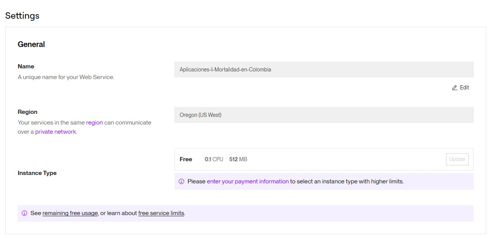
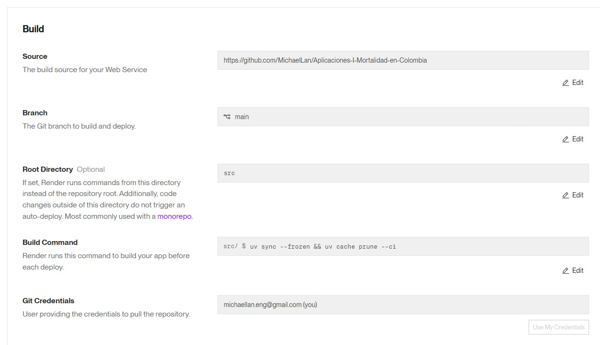
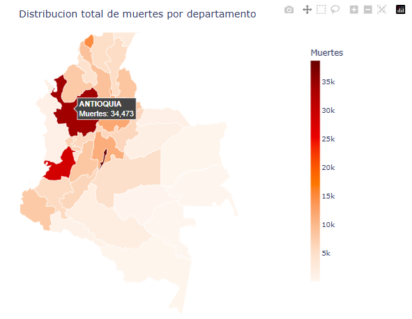
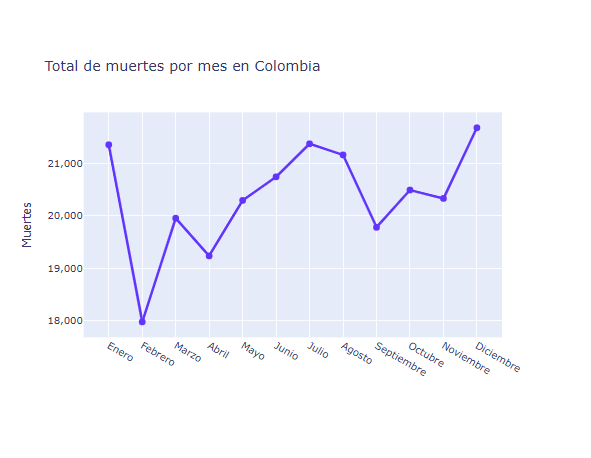
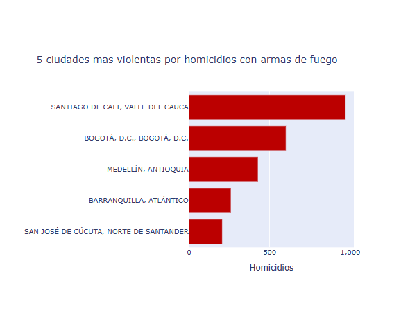
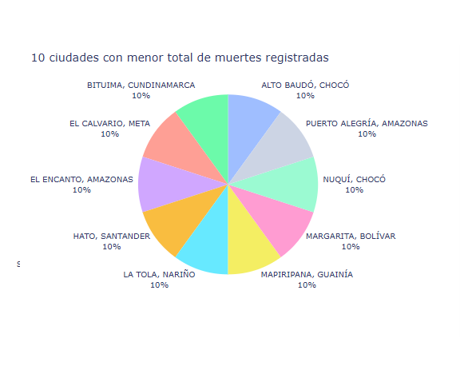
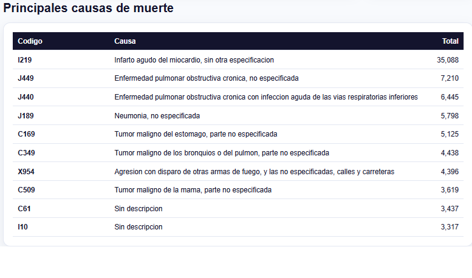
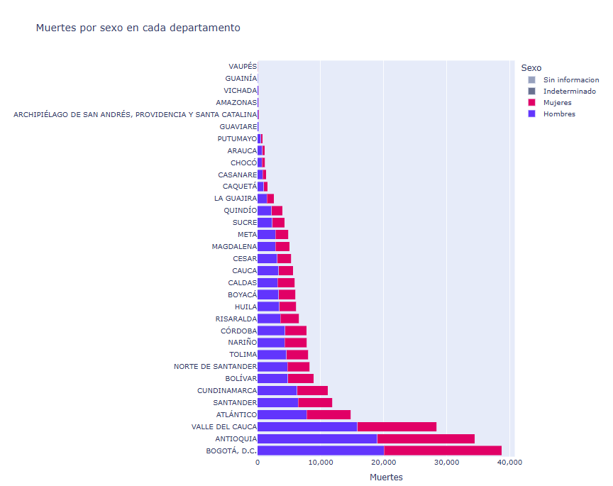
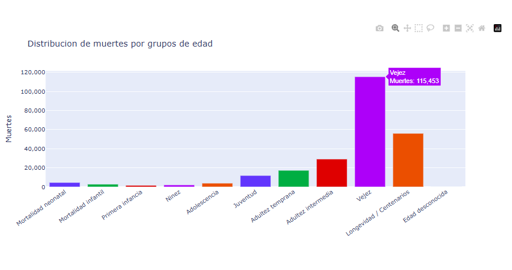

# Análisis de Mortalidad en Colombia (2019)

### Maestría en Inteligencia Artificial — Universidad de La Salle

* **Curso:** Aplicaciones 1
* **Tema:** Aplicación web interactiva para el análisis de mortalidad en Colombia
* **Estudiantes:** 
  * **Carlos Arnulfo Cogua Laverde**
  * **Michael Lan Alvarez**
* **Aplicación en Producción (Render):** [https://aplicaciones-i-mortalidad-en-colombia.onrender.com](https://aplicaciones-i-mortalidad-en-colombia.onrender.com)
* **Repositorio del Proyecto (GitHub):** [https://github.com/MichaelLan/Aplicaciones-I-Mortalidad-en-Colombia](https://github.com/MichaelLan/Aplicaciones-I-Mortalidad-en-Colombia)

---

## Introduccion del proyecto

Esta es una aplicacion web dinamica hecha con Python y Dash para explorar datos
de mortalidad no fetal en Colombia durante el año 2019.

Consta de un tablero sencillo, interactivo y facil de revisar, con mapas,
graficos y una tabla resumen que ayuden a identificar patrones por departamento,
ciudad, sexo, mes, causa de muerte y grupo de edad.

## Objetivo

Analizar visualmente la mortalidad registrada en Colombia durante 2019 para
responder preguntas como:

- En que departamentos se concentran mas muertes.
- Como cambia el total de muertes durante los meses del anño.
- Cuales ciudades registran mas homicidios asociados a codigos `X95*` "Homicidios".
- Cuales ciudades tienen menor total de muertes registradas.
- Cuales son las causas de muerte mas frecuentes.
- Como se distribuyen las muertes por sexo en cada departamento.
- Que grupos de edad concentran mas casos de mortalidad.

## Estructura del proyecto

```text
.
├── data/
│   ├── Colombia.geo.json
│   ├── codigos_muerte.xlsx
│   ├── divipola.xlsx
│   └── no_fetal_2019.xlsx
├── docs/
│   └── images/
├── src/
│   ├── app.py
│   ├── data.py
│   ├── figures.py
│   ├── main.py
│   └── config/
│       ├── config.py
│       └── logger.py
├── pyproject.toml
├── uv.lock
└── README.md
```

Archivos principales:

- `data/`: son los archivos base usados por la aplicacion.
- `src/data.py`: carga los Excel y prepara los datos agregados.
- `src/figures.py`: construye las visualizaciones interactivas con Plotly.
- `src/app.py`: define el layout principal de Dash.
- `src/main.py`: punto de entrada para ejecutar la aplicacion localmente.
- `src/config/`: configuracion y logging de la aplicacion.
- `docs/images/`: carpeta sugerida para guardar las capturas del README.

## Requisitos

Versiones principales usadas por el proyecto:

- Python `>=3.12`
- Dash `>=4.1`
- Polars con soporte Excel `>=1.40.1`
- Pydantic Settings `>=2.14.1`

Dependencias de desarrollo:

- Ruff `>=0.15.12`
- ty `>=0.0.35`
- prek `>=0.3.13`

## Software

Herramientas utilizadas:

- Python para el procesamiento y la ejecucion de la aplicacion.
- Dash para construir la aplicacion web.
- Plotly para los graficos interactivos.
- Polars para cargar y transformar los datos.
- uv para manejar dependencias y entorno virtual.
- Ruff y ty para formato, linting y revision de tipos.

## Instalacion


Clonar el repositorio:

```bash
git clone <url-del-repositorio>
cd mortalidad_colombia_app_web
```

Instalar dependencias:

```bash
uv sync --dev
```

Ejecutar la aplicacion:

```bash
uv run python src/main.py
```

Abrir en el navegador:

```text
http://127.0.0.1:8050
```


Variables opcionales:

- `APP_HOST`: host del servidor. Valor por defecto: `127.0.0.1`.
- `APP_PORT`: puerto del servidor. Valor por defecto: `8050`.
- `APP_DEBUG`: activa o desactiva modo debug. Valor por defecto: `false`.

## Despliegue
La aplicacion fue desplegada en Render como un Web Service conectado al repositorio de GitHub.
### Configuracion general

El servicio se creo en Render usando el plan gratuito. La aplicacion queda asociada al repositorio del proyecto y se despliega automaticamente cuando hay cambios en la rama configurada.
### Configuracion de build

La rama usada para el despliegue fue main.
Render se configuro con el directorio raiz src, por lo que los comandos se ejecutan desde esa carpeta.
Build Command:
```bash
uv sync --frozen && uv cache prune --ci
Este comando instala las dependencias del proyecto usando uv y limpia cache innecesaria para el entorno de despliegue.
Configuracion de ejecucion
Configuracion de deploy en Render
Start Command:
APP_PORT=$PORT uv run main.py
Render asigna automaticamente el puerto mediante la variable $PORT. Por eso se pasa ese valor a APP_PORT, que es la variable usada por la aplicacion para iniciar el servidor Dash.
Variables de entorno utilizadas:
LOG_LEVEL=INFO
APP_HOST=0.0.0.0
APP_DEBUG=false
Con esta configuracion, la aplicacion queda disponible publicamente desde la URL generada por Render.

## Visualizaciones y resultados

En esta sección se presentan los resultados clave obtenidos tras la ejecución del tablero interactivo, acompañados de una interpretación y análisis epidemiológico y demográfico riguroso para cada una de las visualizaciones.

---

### 1. Mapa de muertes por departamento



#### Interpretación y Análisis
El mapa coroplético representa la distribución espacial del total de muertes registradas en Colombia a nivel departamental. Se evidencia un patrón de alta concentración en la región andina y la costa Caribe:

* **Focos de Alta Concentración:** El departamento de **Antioquia** destaca por encima de todos con el valor absoluto más alto (más de 34,000 defunciones), seguido de cerca por **Bogotá D.C.** y el **Valle del Cauca**.
* **Zonas Periféricas de Bajo Registro:** Los departamentos del sur y oriente del país (como Vaupés, Guainía, Amazonas y Vichada) muestran intensidades cromáticas mínimas, reportando en ocasiones menos de 100 muertes totales en el año.

**Análisis Epidemiológico:** Esta distribución refleja, en primer orden, el peso demográfico de cada región (a mayor población, mayor cantidad absoluta de decesos). No obstante, la enorme brecha entre el centro del país y la periferia también pone de manifiesto factores estructurales:
1. **Subregistro de Mortalidad:** En departamentos de la periferia (Amazonas, Vaupés) existe un subregistro histórico debido a la dispersión geográfica y a la falta de cobertura de oficinas de registro civil y centros de salud de alta complejidad.
2. **Dinámicas de Violencia y Envejecimiento:** Regiones como Antioquia y Valle del Cauca experimentan simultáneamente una transición demográfica avanzada (población más envejecida expuesta a enfermedades crónicas) y dinámicas de violencia urbana que incrementan las muertes por causas externas.

---

### 2. Muertes por mes



#### Interpretación y Análisis
El gráfico de línea temporal muestra la evolución mensual de las defunciones durante el año 2019:

* **El "Efecto Febrero":** Se observa un marcado y abrupto descenso en el mes de febrero, alcanzando el punto más bajo del año con aproximadamente **18,200 muertes**.
* **Picos Estacionales:** Los meses de **enero** y **agosto** registran los mayores picos del año, superando las **21,300 muertes**.

**Análisis Epidemiológico:** 
1. **Factor Estadístico:** El valle en febrero no responde a un factor biológico o de salud pública que reduzca el riesgo de morir, sino a un **sesgo estadístico temporal**: febrero cuenta con solo 28 días (un 10% menos de días que enero o marzo), lo que reduce naturalmente el acumulado mensual total de registros.
2. **Estacionalidad y Eventos Externos:** Los picos observados en diciembre y enero son fenómenos globales consistentes. En Colombia, el incremento en fin y principio de año se correlaciona con:
   * Aumento en las **muertes por causas externas** (accidentes de tránsito, riñas y homicidios asociados a festividades).
   * Incremento en la mortalidad de población de la tercera edad debido a picos de afecciones cardiovasculares y respiratorias asociadas a cambios de temperatura de la época.

---

### 3. Cinco ciudades mas violentas



#### Interpretación y Análisis
Este gráfico de barras horizontales aísla los homicidios asociados específicamente al código de causa `X95*` (Agresión por disparo de otras armas de fuego y las no especificadas) para identificar los principales centros urbanos afectados por la violencia letal:

* **Liderazgo Preocupante:** **Santiago de Cali** lidera el gráfico a nivel nacional por un margen alarmante, registrando cerca de **1,000 homicidios** con arma de fuego.
* **Comparativa Urbana:** **Bogotá D.C.** ocupa el segundo lugar (aproximadamente 600 casos), seguida de **Medellín** (~430), **Barranquilla** (~250) y **San José de Cúcuta** (~200).

**Análisis Sociológico y de Seguridad:**
Cali muestra una desproporción sumamente severa. A pesar de tener menos de un tercio de la población de Bogotá D.C., registra casi el **doble de homicidios por armas de fuego**. Esto evidencia factores complejos de orden público en el Valle del Cauca: disputas de pandillas, delincuencia organizada y corredores de narcotráfico. El caso de Cúcuta en el top 5 refleja las dinámicas complejas de frontera, marcadas por flujos migratorios y presencia de grupos armados al margen de la ley controlando economías informales en 2019.

---

### 4. Ciudades con menor mortalidad registrada



#### Interpretación y Análisis
El gráfico circular detalla los 10 municipios o distritos con el menor volumen de fallecimientos en el país:

* **Distribución Equitativa de Bajos Registros:** Corresponden principalmente a corregimientos departamentales y municipios con poblaciones sumamente reducidas ubicados en la periferia nacional (regiones como la Amazonía o la Orinoquía).

**Análisis Metodológico:**
Es de vital importancia abordar esta visualización con **criterio epidemiológico y demográfico**:
1. **Ausencia de Tasas:** La gráfica trabaja con valores absolutos. Por tanto, que un municipio aparezca aquí no significa que posea mejores condiciones de vida o salud, sino simplemente que su **población total es minúscula** (algunos con menos de 1,000 habitantes), reduciendo la probabilidad matemática de registrar decesos.
2. **Subregistro Crítico:** Vuelve a operar la barrera de la distancia y el subregistro. Muchas defunciones en estas áreas remotas ocurren en resguardos indígenas o áreas rurales dispersas y son enterradas bajo la tradición local sin pasar jamás por el sistema oficial de estadísticas vitales del DANE.

---

### 5. Principales causas de muerte



#### Interpretación y Análisis
La tabla resume las principales causas específicas de muerte que sufren los colombianos, lo que permite trazar el perfil epidemiológico del país:

* **La Causa Reina:** Las **Enfermedades Isquémicas del Corazón** (encabezadas por el Código `I219` - Infarto agudo de miocardio, sin otra especificación) lideran con una diferencia abrumadora sobre las demás.
* **Patologías Crónicas dominantes:** Las enfermedades cerebrovasculares (`I64X`), las enfermedades respiratorias crónicas de las vías inferiores (`J449`) y la diabetes mellitus (`E119`) ocupan los siguientes lugares principales del top nacional.

**Análisis Epidemiológico:**
Colombia se encuentra plenamente consolidada en la **transición epidemiológica**. Los decesos por enfermedades infecciosas y parasitarias (comunes en el siglo pasado) han sido ampliamente desplazados por patologías crónicas no transmisibles asociadas a:
* El envejecimiento paulatino de la población colombiana.
* Estilos de vida modernos (sedentarismo, dietas con altos contenidos de sodio, grasas saturadas y azúcares ultraprocesados).
* Tabaquismo y exposición crónica a biomasa (humo de leña en cocinas rurales tradicionales, reflejado en el EPOC/`J449`).

---

### 6. Muertes por sexo y departamento



#### Interpretación y Análisis
Este gráfico de barras apiladas compara la mortalidad agregada diferenciando por el sexo biológico del fallecido en cada departamento:

* **Brecha de Género:** Se observa de manera sistemática y contundente en todos los departamentos que **las muertes masculinas superan significativamente a las femeninas**, duplicando o triplicando las cifras en departamentos con alta conflictividad o urbanización.

**Análisis de Género y Epidemiología:**
Este fenómeno se conoce en demografía como **sobremortalidad masculina** y se sustenta principalmente en dos dimensiones:
1. **Causas Externas y Violencia:** Los hombres jóvenes en Colombia son las principales víctimas de homicidios, accidentes de tránsito y suicidios debido a patrones conductuales de mayor exposición al riesgo y dinámicas sociales de violencia.
2. **Cuidado de la Salud:** Los hombres muestran menores tasas de adherencia a controles médicos preventivos y diagnóstico temprano de patologías cardiovasculares y metabólicas, lo que acelera el desenlace mortal en edades medianas.
3. **Mortalidad Femenina:** Por el contrario, la mortalidad de las mujeres está más concentrada en la vejez avanzada, vinculada a enfermedades cardiovasculares crónicas o demencias seniles.

---

### 7. Distribucion por grupos de edad



#### Interpretación y Análisis
El histograma detalla en qué fases del ciclo vital de la población colombiana se concentran los decesos:

* **La Curva en "J" o "U" modificada:** Se percibe una estructura demográfica de mortalidad clásica:
  1. **Pico Neonatal/Infantil:** Un repunte al extremo izquierdo en menores de 1 año (mortalidad neonatal y de la primera infancia).
  2. **Valle de la Niñez:** Un descenso marcado y estable durante la etapa escolar y adolescencia temprana.
  3. **Pico Joven-Adulto (El "bache" de la violencia):** Una elevación en los grupos de edad joven y joven-adulta (18 a 35 años), especialmente pronunciado en varones.
  4. **Crecimiento Exponencial Senil:** Un incremento pronunciado a partir de los 60 años, concentrando la gran mayoría de muertes en la vejez avanzada y longevidad.

**Análisis Demográfico:**
Este comportamiento resume la historia del desarrollo y las deudas de salud pública del país:
* El pico al extremo izquierdo delata los retos persistentes en salud materno-infantil y acceso a controles neonatales de calidad, especialmente en las zonas rurales de Colombia.
* El aumento intermedio (18-35 años) rompe la tendencia natural de baja mortalidad en personas biológicamente fuertes y sanas. Este pico es provocado directamente por las **causas externas** (violencia letal y accidentes viales).
* La masiva acumulación al extremo derecho es el reflejo del comportamiento biológico natural de envejecimiento celular y de la consolidación de la transición demográfica colombiana.
